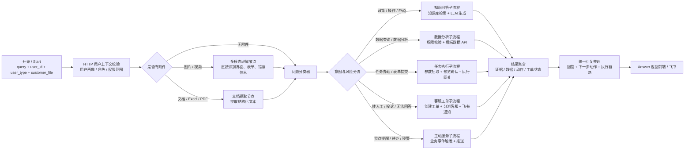
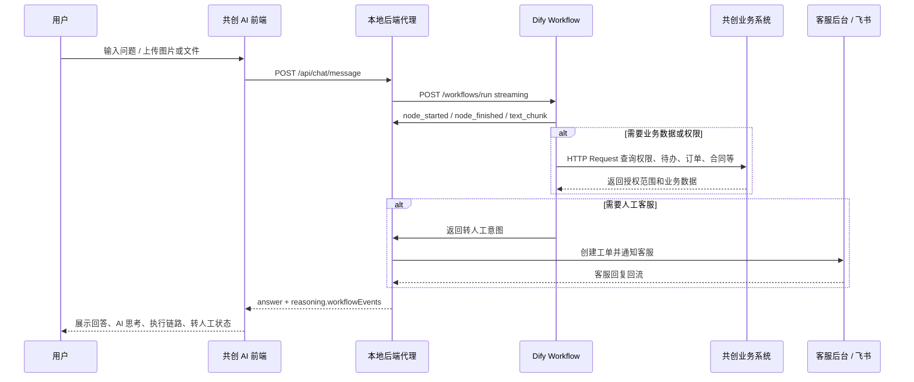

# 共创平台 AI 助手 2026 Dify 流程设计

## 总体原则

不要用一个超长 Dify 节点链承载所有能力。推荐拆成：

1. `共创 AI 助手总入口`：面向前端、飞书、小程序等统一入口，负责身份识别、意图分类、风险控制和路由。
2. `知识问答子流程`：处理政策、规则、流程、操作手册、FAQ。
3. `数据分析子流程`：通过后端 API/MCP 查询数仓和业务系统，Dify 只做自然语言理解和结果解释。
4. `任务执行子流程`：表单填写、流程办理、工单创建、菜单跳转等动作全部走后端执行网关。
5. `人工客服子流程`：转人工、客服分配、飞书通知、客服回复回流。
6. `主动服务子流程`：外部定时任务或业务事件触发 Dify，总结待办/风险/进度后推送。

Dify 负责“理解、编排、生成”，后端负责“权限、数据、执行、审计”。

## Dify 应用建议

| 应用 | Dify 类型 | 用途 | 是否面向用户 |
| --- | --- | --- | --- |
| 共创 AI 助手总入口 | Advanced Chat / Chatflow | 用户对话入口、角色分流、上下文管理 | 是 |
| 业务知识库问答 | Workflow | FAQ、政策、操作流程、规则咨询 | 否，作为子流程 |
| 数据查询分析 | Workflow | 经营数据、合作数据、库存、订单、对账查询 | 否，作为子流程 |
| 附件多模态识别 | Workflow / Chatflow | 图片、视频、线下表单、合同、票据识别 | 否，作为子流程 |
| 任务执行与表单办理 | Workflow | 对话式填表、流程办理、菜单跳转、进度追踪 | 否，作为子流程 |
| 客服工单分派 | Workflow | 转人工、问题分类、客服组匹配、飞书通知 | 否，作为子流程 |
| 主动推送助手 | Workflow | 每日待办、指标预警、节点通知、商机提醒 | 否，由事件触发 |

## 总入口 Start 变量

| 变量名 | 类型 | 必填 | 说明 |
| --- | --- | --- | --- |
| `query` | Text | 是 | 用户原始问题 |
| `user_id` | Text | 是 | 登录用户 ID / 工号 / 合作伙伴账号 |
| `user_name` | Text | 否 | 用户姓名 |
| `user_type` | Select | 是 | `员工`、`加盟商`、`供应商`、`经销商`、`消费者` |
| `user_role` | Text | 否 | 总部管理、地区执行、加盟老板、社区长、商务联系人等 |
| `org_id` | Text | 否 | 组织 ID / 公司主体 ID |
| `partner_id` | Text | 否 | 供应商/加盟商/经销商主体 ID |
| `store_id` | Text | 否 | 门店 ID，门店角色使用 |
| `department` | Text | 否 | 内部员工部门 |
| `channel` | Select | 是 | `共创Web`、`飞书`、`APP`、`小程序` |
| `page_code` | Text | 否 | 当前页面/菜单编码，用于菜单定位和上下文 |
| `page_context` | Paragraph | 否 | 当前页面状态、已选对象、表单上下文 |
| `customer_file` | File / Array[File] | 否 | 图片、文档、视频、线下表单 |
| `session_id` | Text | 否 | 会话 ID |
| `request_id` | Text | 是 | 幂等和审计 ID |

## 总入口主流程

| 顺序 | 节点 | 类型 | 输入 | 输出 | 说明 |
| --- | --- | --- | --- | --- | --- |
| 1 | 用户上下文校验 | HTTP Request | `user_id`、`channel` | `user_profile`、`permission_scope` | 从共创平台后端获取身份、角色、组织、数据权限 |
| 2 | 附件判断 | If/Else | `customer_file` | `has_file` | 有附件先进入多模态/文档解析 |
| 3A | 图片/视频理解 | LLM Vision | `query`、`customer_file` | `vision_result` | 用多模态模型直接看内容，不走 OCR 兜底冒充 |
| 3B | 文档提取 | Document Extractor | `customer_file` | `document_text` | PDF/Word/Excel/CSV 先提取文本 |
| 4 | 角色与意图分类器 | Question Classifier | `query`、`user_profile`、附件结果 | `intent`、`domain`、`risk_level` | 判断走知识、数据、任务、客服、主动推送 |
| 5 | 风险与权限判断 | If/Else / HTTP | `intent`、`permission_scope` | `can_answer`、`need_confirm` | 数据查询、导出、审批、修改必须经过权限与确认 |
| 6 | 路由分支 | If/Else | `domain` | 分支 | 分到知识问答、数据分析、任务执行、客服工单 |
| 7 | 结果汇总 | Variable Aggregator | 各子流程输出 | `final_context` | 汇总证据、数据、动作结果 |
| 8 | 回复生成 | LLM | `final_context`、`user_profile` | `answer`、`next_actions` | 输出可执行答案和按钮动作 |
| 9 | Answer | Answer | `answer` | - | 返回前端/飞书 |

## Dify 编排流程图



## 用户端运行流程图



## 意图分类表

| 一级意图 | 二级场景 | 用户范围 | Dify 路由 |
| --- | --- | --- | --- |
| 政策/规则咨询 | 公司政策、合作规则、活动规则、权限说明 | 全角色 | 知识问答 |
| 系统操作指引 | 入驻、合同签订、人员管理、菜单定位、忘记账号、信息变更 | 全角色 | 知识问答 + 菜单跳转 |
| 数据查询 | 经营数据、订单、库存、叫货、对账、分润、费用、销售 | 按角色授权 | 数据分析 |
| 数据分析 | 趋势分析、异常预警、原因解释、建议动作 | 员工、管理者、合作伙伴管理人员 | 数据分析 |
| 任务执行 | 表单填写、流程办理、进度追踪、导出、预约、报名 | 按角色授权 | 任务执行 |
| 附件识别 | 图片、视频、合同、线下表单、票据、Excel | 全角色 | 多模态/文档识别 |
| 投诉建议 | 付款周期、送货预约、保证金、沟通需求 | 供应商、经销商、加盟商 | 客服工单 |
| 转人工 | 明确要求人工、AI 无法回答、高风险处理 | 全角色 | 客服工单分派 |
| 主动服务 | 待办、商机、节点提醒、指标预警 | 全角色 | 主动推送 |

## 角色分流规则

| 用户类型 | 重点知识库 | 重点数据 API | 重点执行动作 |
| --- | --- | --- | --- |
| 总部管理人员 | 战略、经营指标口径、管理制度 | 供应链成本、加盟经营、经销业绩、核心指标 | 指标预警查看、报表分析 |
| 总部/地区执行人员 | 流程政策、活动规则、系统操作 | 区域、门店、供应链、经销数据 | 流程办理、进度追踪、任务处理 |
| 加盟商老板/管理人员 | 加盟政策、合同、组织人员、费用规则 | 叫货、分润、运费、订单、库存、费用收入 | 入驻、合同、人员管理、数据导出 |
| 门店社区长/美食顾问 | 门店操作、任务规则、政策咨询 | 门店库存、叫货、订单、费用、对账 | 门店任务、流程操作 |
| 供应商对接人 | 入驻、选品、合同、报价、送货、对账 | 对账、发票、库存、销售、订单计划、质控 | 商机报名、报价、送货预约、入库查询 |
| 经销商对接人 | 经销政策、合同、商品规则 | 叫货权限、库存、商品效期、订单 | 成为经销商、信息变更、反馈渠道 |

## 知识库设计

| 知识库 | 内容 | 分段建议 |
| --- | --- | --- |
| 员工政策与流程库 | 战略解读、内部流程、活动规则、审批规则 | 按制度/流程/FAQ 分段 |
| 加盟商知识库 | 加盟政策、合同、门店组织、费用、叫货、订单 | 按角色和业务流程分段 |
| 供应商知识库 | 入驻、选品、合同、报价、竞价、对账、送货、质控 | 按入驻/合同/商品/订单/结算分段 |
| 经销商知识库 | 经销政策、合同、商品需求、库存、反馈 | 按业务阶段分段 |
| 系统操作手册库 | 页面路径、菜单入口、常见报错、操作步骤 | 每条知识绑定 `page_code`、角色 |
| 客服工单知识库 | 工单类型、客服组、SLA、转人工规则 | 用于分派和兜底 |

## 数据分析子流程

| 节点 | 类型 | 作用 |
| --- | --- | --- |
| 数据意图解析 | LLM / Classifier | 判断用户要查指标、明细、趋势、异常、导出 |
| 权限校验 | HTTP Request | 根据 `user_id`、`user_type`、`partner_id`、`store_id` 获取可查范围 |
| 指标映射 | Code / LLM | 把自然语言映射到指标编码和数据域 |
| 数据查询 | HTTP Request | 调用数仓/业务后端，不让 Dify 直连数据库 |
| 数据解释 | LLM | 解释结果、异常原因、下一步建议 |
| 风险拦截 | If/Else | 导出、敏感数据、跨主体查询需要确认或拒绝 |

数据查询 API 建议统一封装：

```text
POST /ai-data/query
{
  "request_id": "...",
  "user_id": "...",
  "user_type": "...",
  "metric_code": "...",
  "dimensions": {},
  "filters": {},
  "permission_scope": {}
}
```

## 任务执行子流程

所有“修改、提交、导出、预约、报名、审批、合同签订”等动作必须做两段式：

1. `preview`：Dify 生成执行计划，后端返回影响范围。
2. `confirm`：用户确认后，后端执行。

| 节点 | 类型 | 说明 |
| --- | --- | --- |
| 任务识别 | Classifier | 判断是否是可执行任务 |
| 参数抽取 | LLM | 抽取表单字段 |
| 缺失字段追问 | If/Else + Answer | 缺字段就追问，不直接提交 |
| 执行预览 | HTTP Request | 调用 `/ai-task/preview` |
| 用户确认 | Answer | 展示影响范围和确认按钮 |
| 执行提交 | HTTP Request | 调用 `/ai-task/execute` |
| 结果回复 | LLM/Answer | 返回工单号、流程号、跳转入口 |

## 客服工单与飞书子流程

| 节点 | 类型 | 作用 |
| --- | --- | --- |
| 转人工判断 | If/Else | 用户明确要求、无答案、高风险、投诉建议 |
| 客服分类 | Classifier | 分类到供应链、加盟运营、技术支持、财务结算、经销业务 |
| 客服在线状态 | HTTP Request | 查询客服组在线/值班 |
| 创建工单 | HTTP Request | 生成工单，绑定当前对话上下文 |
| 飞书通知 | HTTP Request | 通知客服人员或群 |
| 回复用户 | Answer | “已接入人工服务，当前对话继续，不跳转” |

转派客服只允许客服后台调用，用户端不展示转派。

## 主动推送子流程

Dify 不负责定时调度。建议由后端任务或业务事件触发 Dify Workflow：

| 触发源 | 推送内容 |
| --- | --- |
| 每日定时任务 | 今日待办、合同状态、订单异常、指标预警 |
| 入驻审核通过 | 下一步操作、资料补充、合同签订入口 |
| 商机报名后 | 补充资料、待办入口、客服协助 |
| 合同/订单/结算节点 | 进度提醒、异常提示、风险原因 |
| 指标异常 | 异常指标、原因分析、建议动作 |

## 阶段落地

| 阶段 | Dify 优先做什么 | 后端优先做什么 |
| --- | --- | --- |
| 第一阶段 | 总入口、角色分流、知识库问答、多模态、客服工单 | 统一 API 代理、文件上传、飞书通知、工单系统 |
| 第二阶段 | 数据意图解析、数据解释、风险监控、线下表单识别 | 数仓查询 API、权限控制、结构化表单接口 |
| 第三阶段 | 主动推送文案生成、任务型对话、多流程编排 | 事件中心、任务调度、执行网关、审计 |

## 当前项目对应关系

| 当前本地能力 | 对应 Dify 设计 |
| --- | --- |
| `src/App.tsx` AI 弹窗/PC 页面 | 总入口前端 |
| `server/index.js /api/chat/message` | Dify 代理与安全网关 |
| `DIFY_WORKFLOW_INPUT_KEY=customer_issue` | Start 节点用户问题 |
| `DIFY_WORKFLOW_FILES_INPUT_KEY=customer_file` | 文件/图片输入 |
| `issue_type` legacy 映射 | 兼容旧三分类 |
| `issue_category` | 来伊份细分类 |
| `urgency_level` | 高/中/低优先级 |
| `tickets` mock | 工单系统接口雏形 |
| `notifyFeishu` | 飞书通知雏形 |

## Dify API 接入约定

根据 Dify「访问 API」页面，本项目按以下方式接入：

| 能力 | Dify API | 本地处理 |
| --- | --- | --- |
| 执行 Workflow | `POST /workflows/run` | 后端统一代理，不在前端暴露 API Key |
| 真实执行线 | `response_mode=streaming` 的 `node_started/node_finished/text_chunk` | 后端解析 SSE，返回给前端 `reasoning.workflowEvents` |
| 文件上传 | `POST /files/upload` | 本地 `/api/upload` 先保存文件，再同步上传 Dify |
| 文件变量 | `inputs.customer_file=[{ transfer_method, upload_file_id, type }]` | 配置 `DIFY_WORKFLOW_FILES_INPUT_KEY=customer_file` 后启用 |
| 高风险确认 | `human_input_required` / `workflow_paused` | 后续可接入前端确认表单；当前高风险先走本地确认策略 |
| 停止响应 | `POST /workflows/tasks/:task_id/stop` | 后续可用于“停止生成” |

推荐配置：

```bash
DIFY_WORKFLOW_RESPONSE_MODE=streaming
```

这样前端可以看到真实 Dify 节点执行链路，而不是只显示本地模拟的“输入 -> 分流 -> 模型 -> 输出”。
